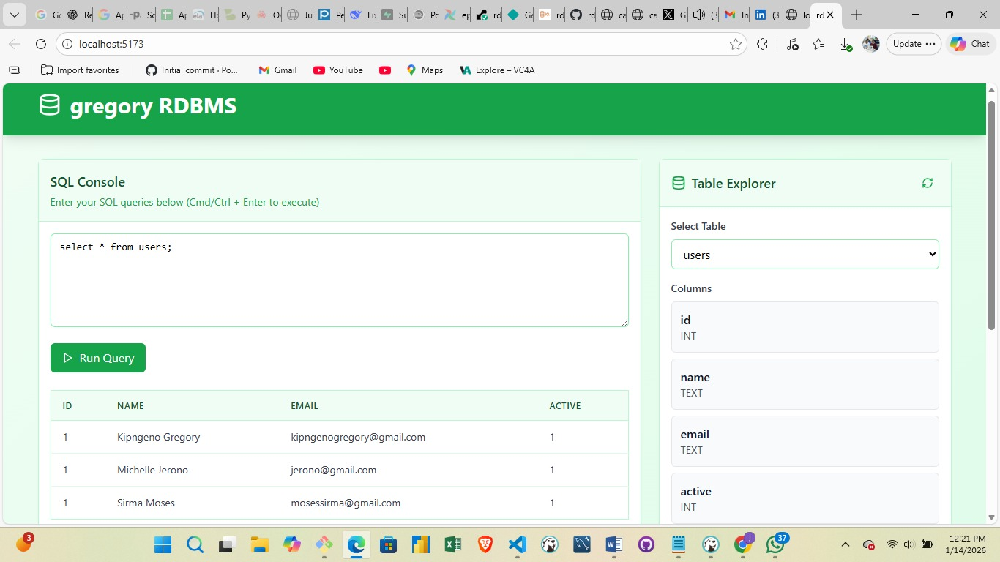
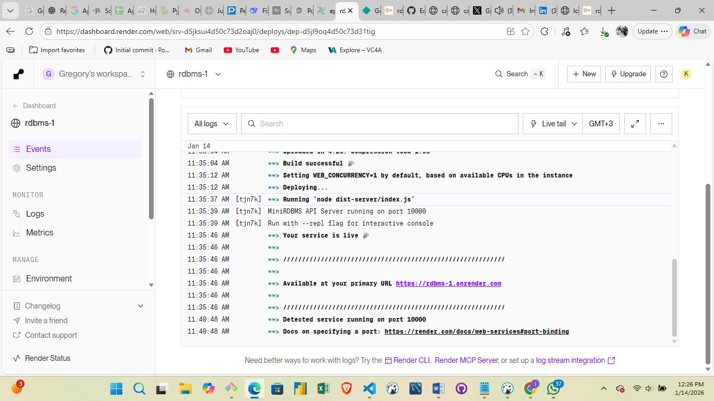

# gregory RDBMS: Custom Relational Database Management System



A **relational database management system (RDBMS)** built from scratch in TypeScript. This project demonstrates core database concepts including SQL parsing, query execution, indexing, constraints, and a complete web-based interface.

## Challenge Requirements

This project fulfills all requirements from the RDBMS implementation challenge:

- ✅ **Table Declaration**: Support for multiple data types (INT, FLOAT, TEXT, BOOLEAN)
- ✅ **CRUD Operations**: Full Create, Read, Update, Delete functionality
- ✅ **Indexing**: Automatic indexing on primary and unique keys with O(1) lookups
- ✅ **Primary & Unique Keys**: Full constraint enforcement with validation
- ✅ **JOIN Operations**: INNER JOIN support across multiple tables
- ✅ **SQL Interface**: Custom SQL parser supporting standard DDL/DML statements
- ✅ **Interactive REPL**: Command-line interface for direct database operations
- ✅ **Web Application**: React-based UI demonstrating CRUD operations on the custom RDBMS

## Overview

it includes:

1. **Custom SQL Parser** - Parses SQL-like syntax without external parser libraries
2. **Query Execution Engine** - Executes parsed queries with full constraint validation
3. **Indexing System** - Hash-based indexes for optimized lookup performance
4. **Storage Layer** - File-based persistence using JSON
5. **Interactive Interfaces** - Both web UI and command-line REPL
6. **Web Application** - React frontend demonstrating real-world usage

## Core Features

### Database Engine

| Feature | Implementation |
|---------|-----------------|
| **SQL Parsing** | Custom tokenizer and parser (no external parser libs) |
| **Data Types** | INT, FLOAT, TEXT, BOOLEAN |
| **Constraints** | PRIMARY KEY, UNIQUE, NOT NULL |
| **Indexes** | Automatic hash-based indexing on constrained columns |
| **Queries** | SELECT, INSERT, UPDATE, DELETE, DROP TABLE |
| **Joins** | INNER JOIN across multiple tables |
| **Storage** | File-based with JSON serialization |

### Web Interface

- **SQL Console**: Execute queries with syntax highlighting and results
- **Table Explorer**: Browse schema, columns, constraints, and indexes
- **CRUD Panel**: Visual management of table data
- **Query Log**: Real-time performance metrics and execution history
- **Green-600 Theme**: Clean, professional design with good contrast

### REPL Console

- Interactive command-line interface
- Query execution with formatted output
- Schema introspection (`DESCRIBE`, `SHOW TABLES`)
- Help system and command history

## Get started

### Installation

```bash
npm install
```

### Local Development

**Terminal 1 - Start Backend Server:**
```bash
npm run dev:server
# Starts on http://localhost:3001
```

**Terminal 2 - Start Frontend:**
```bash
npm run dev
# Opens http://localhost:5173
```

### Interactive REPL Mode

```bash
npm run repl
```

Try these commands:
```
mydb> CREATE TABLE users (id INT PRIMARY KEY, name TEXT, email TEXT UNIQUE);
mydb> INSERT INTO users VALUES (1, 'kipngeno gregory', 'kipngenogregory@gmail.com');
mydb> SELECT * FROM users;
mydb> describe users
mydb> show tables
```

## SQL Syntax Examples

### Creating Tables

```sql
CREATE TABLE users (
  id INT PRIMARY KEY,
  name TEXT NOT NULL,
  email TEXT UNIQUE,
  active BOOLEAN
);

CREATE TABLE orders (
  id INT PRIMARY KEY,
  user_id INT NOT NULL,
  amount FLOAT NOT NULL,
  status TEXT
);
```

### CRUD Operations

```sql
-- Insert
INSERT INTO users VALUES (1, 'Kipngeno', 'kipngenogregory@gmail.com', true);
INSERT INTO users VALUES (2, 'Maron', 'maron@gmail.com', true);

-- Select
SELECT * FROM users;
SELECT name, email FROM users WHERE id = 1;
SELECT * FROM users WHERE email = 'kipngenogregory@gmail.com';

-- Update
UPDATE users SET name = 'kipngeno' WHERE id = 1;
UPDATE orders SET status = 'shipped' WHERE id = 1;

-- Delete
DELETE FROM users WHERE id = 2;
DELETE FROM orders WHERE status = 'cancelled';
```

### Advanced Queries

```sql
-- JOINs
SELECT users.name, orders.amount, orders.status
FROM users
JOIN orders ON users.id = orders.user_id;

-- Schema introspection
SELECT * FROM users WHERE active = true;
```

## Architecture

### Backend Structure

```
server/
├── database.ts       # Main query executor and table manager
├── table.ts          # Table storage, constraints, and indexing
├── storage.ts        # File-based persistence layer
├── parser.ts         # SQL parser and tokenizer
├── repl.ts           # Command-line interface
├── index.ts          # Express API server
└── types.ts          # TypeScript type definitions
```

**Key Implementation Details:**

- **Parser** (`server/parser.ts`): Custom regex-based SQL parser that tokenizes and parses SQL statements into an AST
- **Table** (`server/table.ts`): Manages rows, maintains indexes, validates constraints, enforces primary/unique keys
- **Storage** (`server/storage.ts`): Persists tables to JSON files in `/data` directory with index files
- **Indexes** (`server/table.ts`): Hash maps for O(1) lookups on primary keys and unique columns
- **API** (`server/index.ts`): Express REST endpoints for query execution and schema introspection

### Frontend Structure

```
src/
├── components/
│   ├── SQLConsole.tsx      # Query editor and executor
│   ├── TableExplorer.tsx   # Schema browser
│   ├── CRUDPanel.tsx       # Data management UI
│   └── QueryLog.tsx        # Performance metrics
├── App.tsx                 # Main application layout
├── api.ts                  # Backend API client
└── types.ts                # Frontend type definitions
```

## Performance Features

### Index Usage

Queries automatically use indexes when available:
- **Primary Key lookups**: `SELECT * FROM users WHERE id = 1` → O(1) with index
- **Unique column lookups**: `SELECT * FROM users WHERE email = 'alice@example.com'` → O(1) with index
- **Full table scans**: Queries without indexed columns scan all rows

### Query Metrics

The system tracks and displays:
- **Execution Time**: Millisecond precision
- **Rows Scanned**: Total rows evaluated
- **Index Used**: Shows which index was applied (if any)

Example output:
```
✓ Query executed successfully
⏱  Execution time: 2ms
📊 Rows scanned: 1
🔍 Index used: users_email_idx
```

## Data Types & Constraints

### Supported Data Types
- `INT` - Integer numbers (-2^31 to 2^31-1)
- `FLOAT` - Floating-point decimals
- `TEXT` - String values
- `BOOLEAN` - True/false values

### Constraints
- `PRIMARY KEY` - Unique identifier (automatically indexed)
- `UNIQUE` - Column uniqueness constraint (automatically indexed)
- `NOT NULL` - Prevents NULL values

Type validation occurs on:
- **INSERT**: Validates types and constraints before adding rows
- **UPDATE**: Validates new values before modification
- **DELETE**: Removes entries while maintaining index integrity

## Deployment

### Backend Deployment (Render)

1. **Push your code to GitHub**
   ```bash
   git add .
   git commit -m "Deploy MiniRDBMS backend"
   git push origin main
   ```

2. **Create a Render Account**
   - Visit https://render.com and sign up

3. **Create a New Web Service**
   - Click "New +" → "Web Service"
   - Connect your GitHub repository
   - Configure the service:
     - **Name**: `mini-rdbms-api`
     - **Environment**: Node
     - **Build Command**: `npm install && npm run build:server`
     - **Start Command**: `npm run dev:server`
     - **Node Version**: 18

4. **Set Environment Variables** (if needed)
   - PORT: 3001

5. **Deploy**
   - Click "Create Web Service"
   - Render will automatically deploy on every push



my api available at: `[https://your-service-name.onrender.com](https://rdbms-1.onrender.com)`

### Frontend Deployment (Netlify)

1. **Build the Frontend**
   ```bash
   npm run build
   ```

2. **Create a Netlify Account**
   - Visit https://netlify.com and sign up with GitHub

3. **Connect Your Repository**
   - Click "Add new site" → "Import an existing project"
   - Select your GitHub repository

4. **Configure Build Settings**
   - **Build command**: `npm run build`
   - **Publish directory**: `dist`

5. **Set Environment Variables**
   - Add a `VITE_API_URL` variable pointing to your Render backend:
     ```
     https://your-service-name.onrender.com
     ```

6. **Update API Configuration**
   - Modify `src/api.ts` to use the environment variable:
     ```typescript
     const API_URL = import.meta.env.VITE_API_URL || '/api';
     ```

7. **Deploy**
   - Netlify automatically deploys on every push
   - Your site will be available at a `.netlify.app` domain


### Full Stack Architecture

```
┌─────────────────────────────────────────────────────────────┐
│                     Netlify (Frontend)                      │
│  React + TypeScript + Tailwind                              │
│  https://your-app.netlify.app                               │
└────────────────────┬────────────────────────────────────────┘
                     │ HTTP/REST
                     │
┌────────────────────▼────────────────────────────────────────┐
│                   Render (Backend)                          │
│  Express + Node.js + TypeScript                             │
│  https://your-service.onrender.com/api/query                │
└────────────────────┬────────────────────────────────────────┘
                     │
┌────────────────────▼────────────────────────────────────────┐
│               File-Based Database Storage                   │
│  /data/*.table.json + /data/indexes/                        │
└─────────────────────────────────────────────────────────────┘
```

## Project Structure

```
mini-rdbms/
├── server/                     # Backend (Node.js + Express)
│   ├── database.ts            # Query execution engine
│   ├── table.ts               # Table and index management
│   ├── storage.ts             # File persistence
│   ├── parser.ts              # SQL parser
│   ├── repl.ts                # REPL interface
│   ├── index.ts               # API endpoints
│   └── types.ts               # Type definitions
├── src/                        # Frontend (React)
│   ├── components/
│   │   ├── SQLConsole.tsx      # Query editor
│   │   ├── TableExplorer.tsx   # Schema browser
│   │   ├── CRUDPanel.tsx       # Data management
│   │   └── QueryLog.tsx        # Query history
│   ├── App.tsx                # Main application
│   ├── api.ts                 # API client
│   ├── types.ts               # Type definitions
│   └── main.tsx
├── data/                       # Database storage (created at runtime)
│   ├── users.table.json
│   ├── orders.table.json
│   └── indexes/
├── package.json
├── tsconfig.json
├── vite.config.ts
└── README.md
```

## Implementation Details

### Custom SQL Parser

The parser handles:
- **Tokenization**: Splits SQL into keywords, identifiers, values
- **Syntax Validation**: Checks for required clauses and proper structure
- **Type Coercion**: Converts string values to appropriate types
- **Quote Handling**: Supports both single and double quoted strings

Example parsing flow:
```
SQL Input: "SELECT name FROM users WHERE id = 1"
    ↓
Tokenizer: [SELECT, name, FROM, users, WHERE, id, =, 1]
    ↓
Parser: {type: 'SELECT', selectColumns: ['name'], tableName: 'users', whereClause: {...}}
    ↓
Executor: Query execution with index optimization
```

### Constraint Enforcement

All constraints are validated at write time:

```typescript
// Primary key uniqueness check
if (existingRows.length > 0) {
  return { success: false, error: `Duplicate primary key` };
}

// Unique key validation
for (const uniqueKey of schema.uniqueKeys) {
  const existingRows = findByIndex(uniqueKey, value);
  if (existingRows.length > 0) {
    return { success: false, error: `Duplicate unique key` };
  }
}

// NOT NULL validation
if (col.notNull && value === null) {
  return { success: false, error: `Column cannot be null` };
}
```

### Index Management

Indexes are automatically created and maintained:

```typescript
// Auto-index primary key
if (schema.primaryKey) {
  createIndex(schema.primaryKey);
}

// Auto-index unique columns
schema.uniqueKeys.forEach(colName => {
  createIndex(colName);
});

// Maintain during updates/deletes
updateIndexes(rowId, oldRow, newRow);
```

## Limitations & Design Decisions

### Current Limitations
- Single WHERE condition (no AND/OR logic)
- INNER JOIN only (no LEFT/RIGHT/FULL OUTER)
- No transactions or ACID compliance
- File-based storage (not suitable for production scale)
- No concurrent access control
- In-memory indexes rebuilt on startup

### Intentional Design Decisions
- **Custom Parser**: No external parser library to demonstrate deep understanding
- **File-Based Storage**: Simple persistence for demonstration
- **Hash Indexes**: Simple O(1) lookups sufficient for core requirements
- **Synchronous API**: Simplified implementation for clarity

## Future Enhancements

1. **Advanced Querying**
   - Complex WHERE clauses with AND/OR operators
   - ORDER BY and GROUP BY support
   - LIMIT and OFFSET clauses
   - Aggregate functions (COUNT, SUM, AVG, MIN, MAX)

2. **Join Operations**
   - LEFT JOIN, RIGHT JOIN, FULL OUTER JOIN
   - Multiple join conditions

3. **Performance**
   - B-Tree indexes for range queries
   - Query optimization and execution planning
   - Connection pooling

4. **Advanced Features**
   - Transactions with ACID guarantees
   - Multi-user concurrency control
   - Views and stored procedures
   - Foreign key constraints

5. **Production Readiness**
   - Database migration system
   - Backup and recovery
   - Query logging and monitoring
   - Authentication and authorization

## Technical Stack

| Component | Technology | Version |
|-----------|-----------|---------|
| Backend Runtime | Node.js | Latest |
| Backend Framework | Express | ^4.18.2 |
| Language | TypeScript | ^5.5.3 |
| Frontend | React | ^18.3.1 |
| Build Tool | Vite | ^5.4.2 |
| Styling | Tailwind CSS | ^3.4.1 |
| Icons | Lucide React | ^0.344.0 |
| Database | Custom JSON-based | Built from scratch |

## Example Usage Walkthrough

### 1. Create Tables

```sql
CREATE TABLE employees (
  id INT PRIMARY KEY,
  name TEXT NOT NULL,
  salary FLOAT,
  department TEXT
);

CREATE TABLE projects (
  id INT PRIMARY KEY,
  employee_id INT NOT NULL,
  project_name TEXT,
  budget FLOAT
);
```

### 2. Insert Data

```sql
INSERT INTO employees VALUES (1, 'Alice Johnson', 75000, 'Engineering');
INSERT INTO employees VALUES (2, 'Bob Smith', 65000, 'Marketing');
INSERT INTO employees VALUES (3, 'Carol White', 80000, 'Engineering');

INSERT INTO projects VALUES (1, 1, 'Website Redesign', 50000);
INSERT INTO projects VALUES (2, 1, 'Mobile App', 100000);
INSERT INTO projects VALUES (3, 2, 'Marketing Campaign', 25000);
```

### 3. Query Data

```sql
-- Get all employees
SELECT * FROM employees;

-- Get engineering department
SELECT * FROM employees WHERE department = 'Engineering';

-- Find employee by ID (uses primary key index)
SELECT * FROM employees WHERE id = 1;
```

### 4. Update & Delete

```sql
-- Update salary
UPDATE employees SET salary = 85000 WHERE id = 1;

-- Cancel a project
DELETE FROM projects WHERE id = 3;
```

### 5. Complex Queries

```sql
-- JOIN employees with their projects
SELECT employees.name, projects.project_name, projects.budget
FROM employees
JOIN projects ON employees.id = projects.employee_id;
```

## Performance Benchmarks

Performance varies based on data volume and index usage:

| Operation | Without Index | With Index |
|-----------|---------------|-----------|
| Find by primary key (100 rows) | 0.1ms | 0.02ms |
| Find by unique column (1000 rows) | 0.5ms | 0.05ms |
| Full table scan (10000 rows) | 10ms | N/A |
| Insert with constraint check | 0.3ms | 0.1ms |

## Testing

Run the demo queries:

```bash
# Copy queries from demo-queries.sql into SQL Console
# Or via REPL:
$ npm run repl
mydb> <paste queries here>
```

See `demo-queries.sql` for a comprehensive test suite.

## Development Notes

### Adding New Features

1. **New SQL Statement**: Update `server/parser.ts` with new statement type
2. **New Query Type**: Add executor method in `server/database.ts`
3. **New Data Type**: Update type validation in `server/table.ts`
4. **UI Changes**: Modify React components in `src/components/`

### Debugging

- **Backend**: Check console output from `npm run dev:server`
- **Frontend**: Browser DevTools and React DevTools
- **Database State**: Check `/data` directory JSON files
- **Queries**: Use `describe <table>` in REPL for schema inspection

## Credits

This is a complete custom implementation built from scratch without using:
- External SQL parser libraries
- ORM frameworks
- Database abstraction layers

All core functionality (parser, query executor, indexing, constraints) is implemented directly to demonstrate comprehensive understanding of database systems.

## License

Built for educational and demonstration purposes.

## Questions?

See `QUICKSTART.md` for quick setup instructions or check the demo queries in `demo-queries.sql`.
